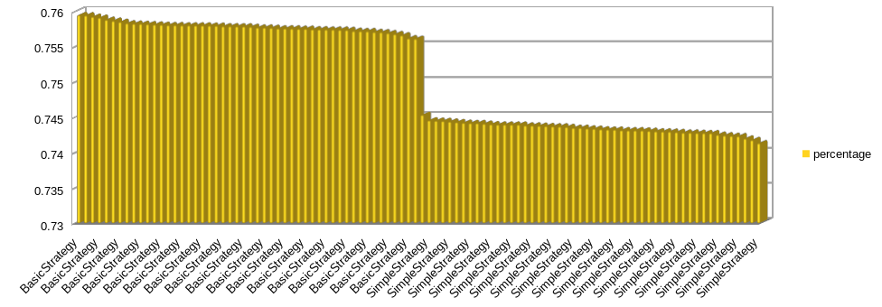

# bjplayer

A BlackJack playing experiment.

`Usage: Main [rounds] [iterations]`

Without arguments Main class will run 10 rounds of 1000000 iterations with each strategy.

Example winning percentage is expected to differ by about 0.01%, as can be summarized in following graph:

